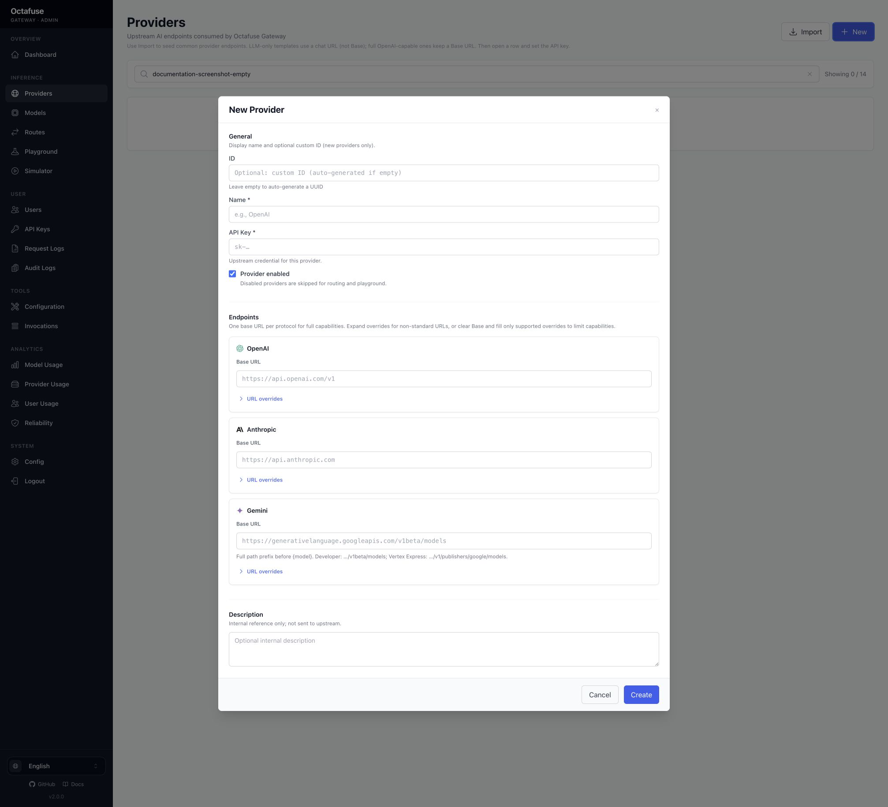
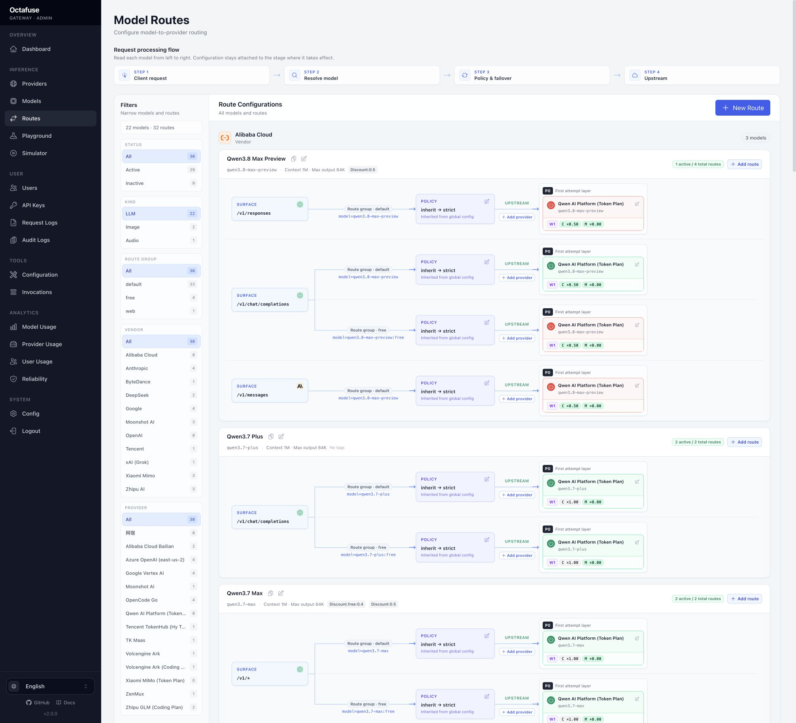

# Admin 配置指南

本页按“部署好以后要做什么”的顺序组织。它不替代 API 文档，只帮助使用者在 Admin 中建立可用配置。

## 1. 先确认实例边界

| 项目 | 说明 |
|------|------|
| Proxy URL | 客户端实际调用地址，例如 `http://localhost:8787` 或 `https://gateway.example.com`。 |
| Admin URL | 管理控制台地址，例如 `http://localhost:8789` 或 `https://gateway-admin.example.com`。 |
| Admin 登录 | 只用于打开管理 UI。 |
| MASTER_KEY | 管理 API Bearer，用于外部系统调用 `/api/admin/*`。生产必须轮换开发默认值。 |
| 用户 API Key | 发给客户端调用 Proxy 的 Key，不应与 MASTER_KEY 混用。 |

## 2. 配置 Provider

Provider 表示一个上游模型入口。**一个 Provider = 一把上游 API Key + 启用状态**（`active` / `disabled`）。

配置时重点检查：

- 上游 Base URL / `endpoints` 与协议类型是否匹配。
- 上游 API Key 是否真实可用（列表为脱敏；明文经 Admin「显示」或 `GET /api/admin/providers/:id/api-key`）。
- Provider `status` 是否为 **active**（disabled 或空密钥的行不会参与调度）。
- 如使用导入模板，导入后须补齐真实 API Key（导入占位 key 会标为 pending）。

需要同一供应商多账号时：创建**多个 Provider**（各一把 key），再在模型下挂多条 Route——不要期望「一个 Provider 多把 key」。

Provider 导入模板的维护说明见 [developers/reference/provider-import-presets.md](../developers/reference/provider-import-presets.md)。



## 3. 配置模型与 Route

2.0 的 Route 页面按 **Request Surface → Route Pool → Upstream Target** 展示：Surface 表示客户端协议 / operation，Pool 表示一组可故障转移的 Target，Target 才是具体 Provider 与上游模型。完整概念见 [developers/architecture/route-topology.md](../developers/architecture/route-topology.md)。



常见做法：

- 对客户端暴露稳定的模型名，例如 `gpt-4.1`、`claude-sonnet` 或团队内部命名。
- 同一模型下配置多个 Provider 路由：
  - **Request protocol / operation**：客户端从哪个协议与操作进入，例如 `openai.chat`、`anthropic.messages`、`openai.images.generations`。
  - **Upstream protocol / operation**：Target 实际调用的供应商能力。2.0 仅开放 `passthrough` adapter，因此请求协议与上游协议必须一致；`*` 用于迁移兼容。
  - **`priority`（层）**：数字**越大**越先试（硬序）。
  - **`weight`（同层）**：配合 Pool / 模型 / 全局路由策略（默认 **hash_affinity**）决定层内顺序。
  - **`route_group`**：如 `default` / `free`，客户端用 `modelId:group` 选择。
- 图片生成模型：导入或手建后确认 `output_modalities` 含 `image`、`pricing_profile` 的 `image_billing_mode`（`token` / `per_image`），并挂 **OpenAI 协议** active 路由；细节见 [developers/reference/image-models.md](../developers/reference/image-models.md)。
- 语音转写模型：导入或手建后确认 `pricing_profile.audio_billing_mode`（`per_second` / `token`）与对应单价块，并挂 **OpenAI 协议** active 路由；细节见 [developers/api/user.md「语音转写」](../developers/api/user.md#语音转写audio-transcriptions)。
- **路由策略**：先按 priority 层读 Route Pool `tier_strategies[priority]`（若有）；否则 Route Pool `strategy` → 模型 `route_policy.rules` 的 `{protocol}.{capability}:{group}` → `{protocol}:{group}` → 模型顶层 `route_policy.strategy` → Admin Config 全局 `ROUTE_STRATEGY` → 代码默认 `hash_affinity`。四种策略及完整键格式见 [developers/reference/route-strategies.md](../developers/reference/route-strategies.md)。
- 在 Route 上配置默认参数，例如思考参数、输出长度或供应商扩展字段。
- 设置价格口径：先维护模型**目录标准价**，再在路由上设用户计费 / 供应成本的基础倍率；如需对齐供应商高峰 / 闲时价，再配置 **Daily schedule**（每日时段倍率，时区见系统配置的业务时区）。
- 在请求日志中核对三笔账：供应成本、目录标准价、用户计费是否符合业务预期。

Route 默认参数合并规则见 [developers/api/user.md](../developers/api/user.md#route-默认参数合并)；时段调价契约见 [developers/api/admin.md](../developers/api/admin.md) 中的 `price_override.schedule`；调度与熔断见 [developers/architecture/proxy-request-lifecycle.md](../developers/architecture/proxy-request-lifecycle.md)。

## 4. 配置 Agent Tools（可选）

Agent Tools 是 Proxy 上面向 Agent 的 **可扩展产品 API**（`/v1/tools/*`），**不是** Chat Completions 的一部分。在 Admin → **Tools → Configuration**：

- 每种工具以 Provider 卡片展示各引擎；点击卡片后在右侧抽屉维护凭证与三账本单价：**Standard（目录标准价）/ Charged（用户扣费）/ Metered（供应成本）**。
- 当前工具与引擎：
  - **Web Search**：博查、Tavily、阿里云 CleverSee、腾讯云联网搜索 WSA
  - **Web Fetch**：Firecrawl、Tavily Extract、Jina Reader
  - **Web Deep Search**：Firecrawl Search、Jina Search
  - **AI Detection**：多引擎 catalog，当前仅腾讯云 TMS 已实现；按 `billingUnitChars` 字符单元计费
- **仅保存配置**不会切换线上引擎；**保存并启用**会保存当前草稿并把该 Provider 设为此工具唯一的 Active。未实现或凭证不完整的引擎不可启用。
- 卡片会提示 Active、未保存、缺少凭证、暂不可用与亏损定价（`charged < metered`）等状态。清空当前 Active 的凭证前，应先切换到另一个凭证完整的引擎。
- 成功请求分别按三种绝对单价写入 `metered_cost` / `standard_cost` / `charged_cost`，仅 **charged** 累加用户预算；上游失败三列均为 0。Tools 不应用模型 Route 倍率或 Daily schedule。币种由 `BILLING_CURRENCY` 决定，调用记录见 **Tools → Invocations**（与 Request Logs 同源）。

字段与引擎白名单见 [developers/api/user.md](../developers/api/user.md) 中各 Tools 章节。

## 5. 创建用户与 API Key

用户 API Key 是客户端真正使用的凭证。对接外部门户时可用 `external_system` 区分产品或租户，并以 `(external_system, external_user_id)` 幂等创建 User；预算归属 User，API Key 负责鉴权、扣费归集和审计。

建议：

- 为不同人、团队、客户或项目创建独立用户或独立 Key。
- 给 Key 设置可识别名称和 metadata，方便后续审计。
- 为用户设置预算与周期重置策略。
- 停用不再需要的 Key，而不是长期共享一把 Key。

用户、Key、预算和审计的数据模型见 [developers/architecture/user-keys-data-model.md](../developers/architecture/user-keys-data-model.md)。

## 6. 验证调用

最小验证：

```bash
curl -sS http://localhost:8787/health
curl -sS http://localhost:8787/catalog/models
```

用户推理、Images、Audio、Tools 与各协议客户端示例见 [connect-clients.md](./connect-clients.md)；完整 API 字段见 [developers/api/user.md](../developers/api/user.md)。

预算状态验证：

```bash
curl -sS http://localhost:8787/v1/me \
  -H "Authorization: Bearer sk-your-api-key"
```

## 7. 日常观察

日常排障优先看：

- 请求日志：是否命中正确模型、Request Surface、Route Pool、Target 与 Provider；重点查看 `request_operation`、`model_surface_id`、`route_pool_id`、`route_target_id`、`route_trace`。`provider_key_*` 现为 provider id / name / key 指纹；Tools 行为 `model_id` 形如 `tool:web-search`。
- 错误状态：401 多半是认证问题；403 常见于预算或配额；502 多与路由或上游有关；全部上游熔断时可能为网关 **429**；Tools 未配置 Active Key 时为 **503**。
- 成本字段：区分 **供应成本**、**目录标准价**、**用户计费**（日志 / API 字段分别为 `metered_cost`、`standard_cost`、`charged_cost`）；Images / Audio 另见 `billing_kind`（及 image count / `audio_duration_seconds` 等列）。
- 审计日志：确认预算扣减、周期重置、Key 生命周期等事件。

更细的日志和计费语义见 [developers/reference/streaming-billing.md](../developers/reference/streaming-billing.md)、[developers/reference/image-models.md](../developers/reference/image-models.md)、[developers/api/user.md「语音转写」](../developers/api/user.md#语音转写audio-transcriptions) 与 [developers/reference/user-audit-logs.md](../developers/reference/user-audit-logs.md)。
